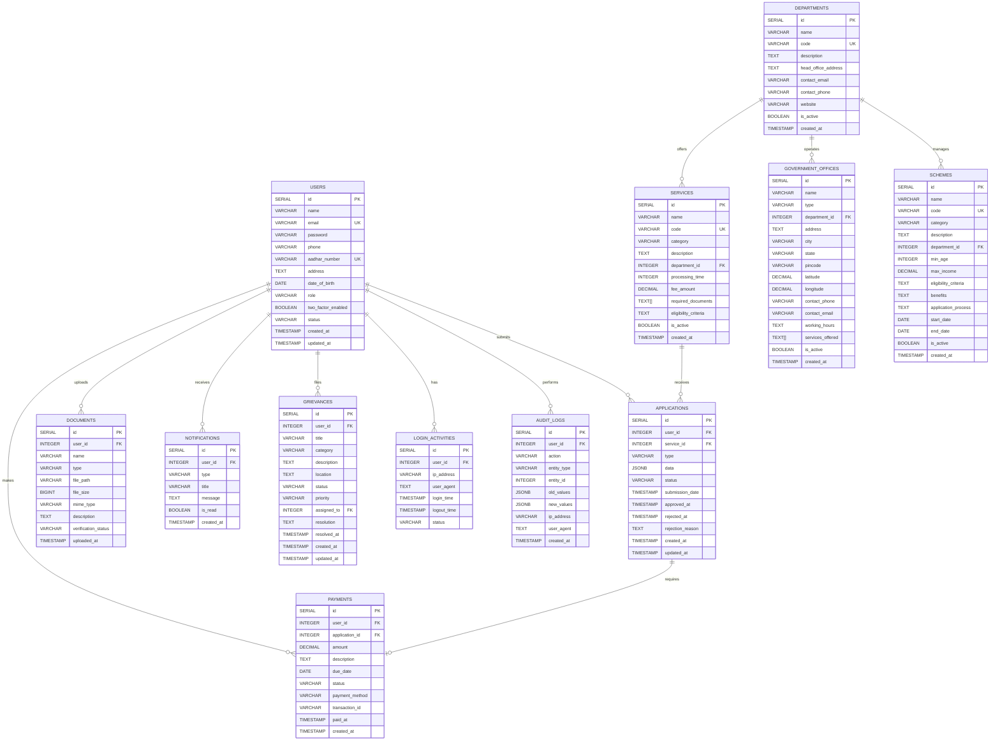

# Sangam Entity Relationship Diagram

## Overview
This document describes the entity relationships in the Sangam database system. The diagram below shows the relationships between all tables in the database.

## ER Diagram Description

## Key Relationships

1. **User to Applications**: One user can submit multiple applications
2. **User to Documents**: One user can upload multiple documents
3. **User to Payments**: One user can make multiple payments
4. **User to Notifications**: One user can receive multiple notifications
5. **User to Grievances**: One user can file multiple grievances
6. **Department to Services**: One department can offer multiple services
7. **Department to Schemes**: One department can manage multiple schemes
8. **Services to Applications**: One service can receive multiple applications
9. **Applications to Payments**: One application may require multiple payments

## Cardinality

- **One-to-Many**: Users to Applications, Documents, Payments, Notifications, Grievances
- **One-to-Many**: Departments to Services, Schemes, Government Offices
- **One-to-Many**: Services to Applications
- **One-to-One**: Application to Payment (optional)

## Notes

- All relationships are implemented using foreign keys
- Cascade rules are defined for referential integrity
- Indexes are created on foreign key columns for performance
- Some relationships are optional (e.g., Application to Payment)
